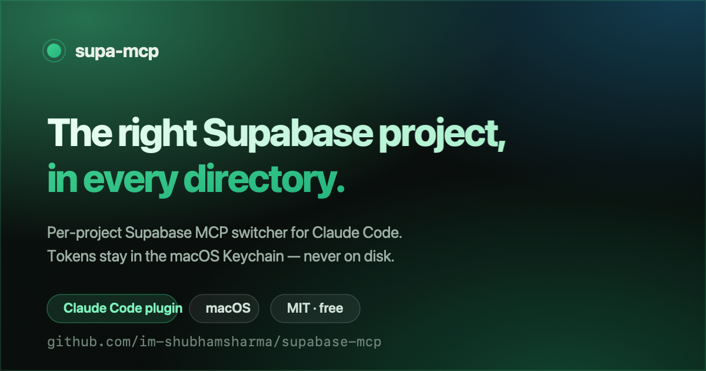

# supa-mcp

<p align="center">
  <a href="https://im-shubhamsharma.github.io/supabase-mcp/">
    
  </a>
</p>

<p align="center"><b><a href="https://im-shubhamsharma.github.io/supabase-mcp/">🌐 Website &amp; docs</a></b></p>


Per-project Supabase MCP switcher for Claude Code, for people who work across several
Supabase projects on more than one account.

Open Claude Code in a project directory and its Supabase MCP connects to exactly that
project's database, on the correct account, read-only by default. Tokens stay encrypted in
the macOS Keychain and never touch disk.

This is a free, open-source (MIT) community project. It is not an official Supabase or
Anthropic product.

## Contents

- [The problem](#the-problem)
- [How it works](#how-it-works)
- [Security](#security)
- [Requirements](#requirements)
- [Install](#install)
- [Quick start](#quick-start)
- [Commands](#commands)
- [The wrong-account guard](#the-wrong-account-guard)
- [Troubleshooting](#troubleshooting)
- [Uninstall](#uninstall)
- [Limitations](#limitations)
- [Contributing](#contributing)
- [License](#license)

## The problem

The default Supabase MCP uses OAuth and connects one organization at a time. If you have a
personal account with three projects and a company account with two organizations, you end
up logging out and back in to switch, and a session open in a company project can still be
pointed at your personal account.

## How it works

- A Supabase Personal Access Token (PAT) is per account, not per organization. One token
  reaches every organization and project in that account, so a personal login and a company
  login are two tokens total.
- `supa-mcp link` writes a `.mcp.json` into the current project directory that pins one
  project (`project_ref`) and names the account it belongs to.
- Claude Code auto-loads `.mcp.json` from the directory it starts in, so the right project
  connects automatically. No manual switching.
- At every connection, Claude Code runs `supa-mcp headers --account <name>`, which reads
  the token from the Keychain in memory and returns the `Authorization` header. This uses
  Claude Code's `headersHelper`, so no token is ever written into `.mcp.json`.

A generated `.mcp.json` looks like this. It holds no secret, so it is safe to commit:

```json
{
  "mcpServers": {
    "supabase": {
      "type": "http",
      "url": "https://mcp.supabase.com/mcp?project_ref=abcd1234&read_only=true",
      "headersHelper": "supa-mcp headers --account company"
    }
  }
}
```

## Security

- Tokens live only in the macOS login Keychain, service name `supa-mcp`, encrypted at rest
  and visible in Keychain Access.app.
- `.mcp.json`, the registry, environment variables, and git never hold a token.
- New links are read-only by default (`read_only=true`). Writes need an explicit `--write`.
- The first MCP connection shows a one-time macOS Keychain prompt for `supa-mcp`. Choose
  "Always Allow" to make it silent afterward.

## Requirements

- **macOS** — `jq`, `curl`, and `security`. `curl` and `security` ship with macOS; install
  `jq` with `brew install jq`.
- **Linux** — `jq`, `curl`, and `secret-tool` (libsecret). On Debian/Ubuntu:
  `sudo apt-get install -y jq libsecret-tools`.

The keychain backend is chosen automatically per OS; override it with
`SUPA_MCP_KEYCHAIN=security|secret-tool` if needed.

## Install

### As a Claude Code plugin (recommended)

Add this repository as a marketplace and install the plugin from inside Claude Code. This
also wires up the `/supa-*` slash commands and the skill:

```
/plugin marketplace add im-shubhamsharma/supabase-mcp
/plugin install supa-mcp@supa-mcp
```

Then put the CLI on your PATH (once per machine):

```
supa-mcp install
```

To pick up later changes, run `/plugin marketplace update supa-mcp` inside Claude Code.

### As a CLI via Homebrew

```
brew install im-shubhamsharma/tap/supa-mcp
```

This is the CLI only (no slash commands). Install the Claude Code plugin as above if you want
the `/supa-*` commands too.

### As a plain CLI from a clone

```
git clone https://github.com/im-shubhamsharma/supabase-mcp.git
cd supabase-mcp
./install.sh          # symlinks supa-mcp into ~/.local/bin
```

Either way, make sure `~/.local/bin` is on your PATH (add
`export PATH="$HOME/.local/bin:$PATH"` to your `~/.zshrc` if needed). Run
`supa-mcp doctor` to check.

Tokens never travel with the repo: they live only in each machine's keychain, so on a new
machine you register that machine's own accounts with `supa-mcp account add <name>`.

## Quick start

Create a Personal Access Token for each Supabase login at
<https://supabase.com/dashboard/account/tokens>. You need one token per account (not per
organization or project).

```
# 1. Register each account (prompts for the token, hidden input, stored in the Keychain)
supa-mcp account add personal
supa-mcp account add company

# 2. See what a token can reach
supa-mcp whoami company

# 3. In a project directory, link it to the right account and project
cd ~/work/company-app
supa-mcp link --account company --project-ref abcd1234

# 4. Start a fresh Claude Code session in that directory. Accept the trust and
#    Keychain prompts. The Supabase MCP is now connected to that project.
```

Inside Claude Code you can drive the same steps with `/supa-add`, `/supa-link`,
`/supa-switch`, `/supa-status`, `/supa-list`, `/supa-branches`, and `/supa-unlink`.

## Commands

| Command | Purpose |
| --- | --- |
| `supa-mcp account add <name>` | Store a PAT in the Keychain (hidden prompt). |
| `supa-mcp account list [--json]` | List registered accounts. |
| `supa-mcp account remove <name>` | Delete an account and its token. |
| `supa-mcp whoami <account> [--json]` | Show the orgs and projects a token can see. |
| `supa-mcp projects <account> [--json]` | List an account's projects. |
| `supa-mcp branches <account> <ref> [--json]` | List a project's Supabase branches. |
| `supa-mcp link --account <n> --project-ref <ref> [--write] [--name <server>]` | Write `./.mcp.json`. |
| `supa-mcp switch [--account <n>] [--project-ref <ref>] [--write]` | Re-point this directory's binding. |
| `supa-mcp status [--json] [--no-verify]` | Show and verify this directory's binding. |
| `supa-mcp statusline [--name <server>]` | One-line binding summary (for status lines). |
| `supa-mcp list [--json] [--verify]` | Every linked directory on this machine. |
| `supa-mcp unlink [--name <server>]` | Remove the server from `./.mcp.json`. |
| `supa-mcp export` / `supa-mcp import [file]` | Move accounts + links between machines (no secrets). |
| `supa-mcp doctor` | Check deps, keychain backend, and token health. |
| `supa-mcp version` | Print the version. |
| `supa-mcp install [dir]` | Put `supa-mcp` on PATH. |

## The wrong-account guard

`supa-mcp status` reads the directory's `.mcp.json` and checks live that the pinned
`project_ref` actually belongs to the linked account. If it does not, it reports
`account_verified: false` so you catch a mislinked directory before you run anything
against it.

When the plugin is installed, a **SessionStart hook** also runs on every session start and
resume. It is local-only and fast: in a linked directory it prints which account and project
are pinned and reminds you to run `/supa-status`; in an unlinked directory it stays silent.

## Working across many projects

- `supa-mcp list` shows every directory you have linked on this machine, with its account,
  project, and mode. It prunes entries whose `.mcp.json` has since been removed; add
  `--verify` to live-check each one against its account.
- `supa-mcp switch --project-ref <ref>` re-points the current directory to another project
  without retyping the account. Add `--account <name>` to move it to a different account, or
  `--write` / `--read-only` to change the mode.

## Supabase branches

`supa-mcp branches <account> <project-ref>` lists a project's branches. A Supabase branch has
its own project ref, so to point a directory at a branch database, link or switch to that
branch's ref:

```
supa-mcp switch --project-ref <branch-ref>
```

## Status line

`supa-mcp statusline` prints a compact one-line summary of the current directory's binding
(`supabase: company/abcd1234 (ro)`), or nothing when the directory is not linked. Wire it
into your Claude Code status line by adding this to `~/.claude/settings.json`:

```json
{
  "statusLine": {
    "type": "command",
    "command": "supa-mcp statusline"
  }
}
```

## Moving to another machine

`.mcp.json` is safe to commit, so teammates who clone a repo already get the binding. To move
your whole setup to another machine, export the (non-secret) account and link registry and
import it on the other side:

```
supa-mcp export > supa-mcp-bundle.json      # on machine A
supa-mcp import supa-mcp-bundle.json         # on machine B
```

Tokens are **not** exported. On the new machine, add each token once with
`supa-mcp account add <name>` — they go into that machine's own keychain.

## Troubleshooting

Run `supa-mcp doctor` first — it checks dependencies, PATH, and the current directory in
one shot.

| Symptom | Fix |
| --- | --- |
| `supa-mcp: command not found` | `~/.local/bin` is not on your PATH. Add `export PATH="$HOME/.local/bin:$PATH"` to `~/.zshrc`, then open a new terminal. |
| `missing dependency: jq` | macOS: `brew install jq`. Linux: `sudo apt-get install -y jq`. |
| `unsupported keychain backend` | Linux needs `secret-tool` (`sudo apt-get install -y libsecret-tools`), or set `SUPA_MCP_KEYCHAIN`. |
| The Supabase MCP does not appear in Claude Code | You must start a **fresh** Claude Code session in the linked directory. Accept the workspace-trust prompt. Check the binding with `supa-mcp status`. |
| A macOS Keychain prompt keeps appearing | Choose **Always Allow** on the `supa-mcp` prompt so it stays silent afterward. |
| `status` shows `account_verified: false` | The pinned project does not belong to the linked account (wrong account). Re-link with the correct `--account`. See [the wrong-account guard](#the-wrong-account-guard). |
| `token stored, but the validation call failed` | The token is invalid or the network is down. Create a new token and re-run `supa-mcp account add <name>`. |
| Writes are rejected | Links are read-only by default. Re-link with `--write` to allow writes from that directory. |

## Uninstall

```
# Remove a single account and its Keychain token
supa-mcp account remove <name>

# Remove the Supabase server from the current directory's .mcp.json
supa-mcp unlink

# Remove the CLI symlink and config (tokens in the Keychain are removed per-account above)
rm -f ~/.local/bin/supa-mcp
rm -rf ~/.config/supa-mcp
```

To remove the Claude Code plugin, run `/plugin uninstall supa-mcp@supa-mcp` inside Claude
Code.

## Limitations

- macOS and Linux are supported. Windows is a planned follow-up (a Credential Manager
  backend plugged into the existing `kc_*` keychain abstraction); use WSL in the meantime.
- One connection per directory by default. You can add more with `--name` (for example a
  separate staging project in the same repo).

## Contributing

Issues and pull requests are welcome at
<https://github.com/im-shubhamsharma/supabase-mcp>. Good first areas: Linux/Windows
Keychain backends, additional tests, and docs. The CLI is a single POSIX-ish Bash script
(`bin/supa-mcp`) with no build step, so a change is easy to try: edit the script and run
`supa-mcp doctor`.

Please do not include real tokens, project refs, or account names in issues or PRs.

## License

MIT © Shubham Sharma. See [LICENSE](LICENSE).
